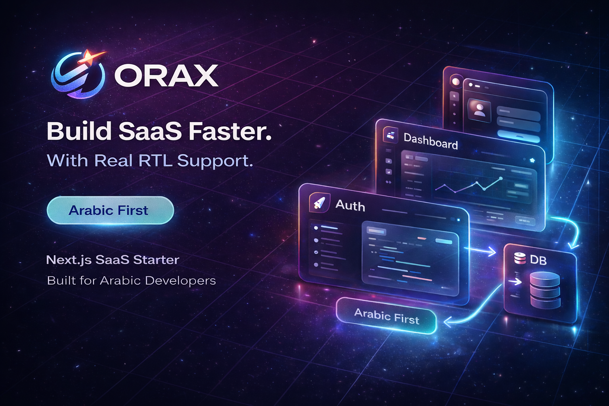

<div align="center">

# ORAX Free
### Build your SaaS presence fast — with a polished bilingual UI (EN/AR) and first-class RTL support.

[](https://nextjs.org/)
[](https://react.dev/)
[](https://www.typescriptlang.org/)
[](#license)

**Live Demo:** https://orax-free.vercel.app/

</div>

---

## ✨ Why ORAX Free?

ORAX Free is not a throwaway demo. It is a **production-style frontend foundation** for modern SaaS products with a premium look, smooth interactions, and a clear structure that is easy to scale.

If your audience includes Arabic speakers, this starter gives you a serious head start with **real RTL/LTR behavior** and bilingual content flow.

---

## 🖼️ Preview



---

## 🚀 What you get

- 🎯 Premium marketing landing experience (Hero, Features, Pricing, FAQ, Final CTA)
- 🌗 Dark / Light theme toggle
- 🌍 Bilingual UX (English + Arabic)
- ↔️ RTL / LTR support
- 🔐 Auth UI screens (Login, Register, Forgot Password, Reset Password)
- 📊 Dashboard UI screens (Dashboard, Billing, Settings)
- 🧩 Reusable UI sections and provider architecture
- 🧭 Locale-aware routing
- 📱 Responsive layout system
- 🧼 Clean codebase with Biome formatting/linting

---

## 🧱 Tech Stack

- **Framework:** Next.js 16 (App Router)
- **UI:** React 19
- **Language:** TypeScript 5
- **Animation / Motion:** GSAP + Framer Motion
- **Styling:** Global CSS architecture + design tokens
- **Icons:** Lucide React
- **Tooling:** Biome

---

## 📂 Project Structure

```text
src/
├─ app/[locale]/
│  ├─ page.tsx                    # Landing page
│  ├─ layout.tsx                  # Locale-aware app layout
│  ├─ not-found.tsx               # Localized 404
│  ├─ (auth)/                     # Auth UI pages
│  │  ├─ login/page.tsx
│  │  ├─ register/page.tsx
│  │  ├─ forgot-password/page.tsx
│  │  └─ reset-password/page.tsx
│  └─ (dashboard)/                # Dashboard UI pages
│     ├─ layout.tsx
│     ├─ dashboard/page.tsx
│     ├─ billing/page.tsx
│     └─ settings/page.tsx
├─ components/
│  ├─ sections/                   # Landing sections
│  ├─ providers/                  # Theme / Locale / Toast providers
│  └─ shared/                     # Shared helpers/components
├─ i18n/
│  ├─ index.ts
│  ├─ routing.ts
│  ├─ types.ts
│  └─ messages/
│     ├─ en.json
│     └─ ar.json
└─ config/
   └─ site.ts
```

---

## ⚡ Quick Start

```bash
pnpm install
pnpm dev
```

Open: `http://localhost:3000`

Build for production:

```bash
pnpm build
pnpm start
```

Lint:

```bash
pnpm lint
```

---

## 🎛️ Customization Guide

- `src/config/site.ts` → brand/site metadata and shared config
- `src/i18n/messages/en.json` → English copy
- `src/i18n/messages/ar.json` → Arabic copy
- `src/app/styles/**` → design tokens, foundations, and section styling
- `src/components/sections/**` → landing section content and layout

---

## ✅ Best for

- SaaS founders validating a product idea quickly
- Teams needing a polished bilingual marketing site
- Developers building Arabic-first startup websites
- Agencies that want a strong frontend base before backend integration

---

## 🧭 Notes

ORAX Free includes rich **frontend UI flows** for auth and dashboard pages.
It does **not** ship with backend logic (database/auth provider/payments API) by default.

---

## 📄 License

ORAX Free is provided for learning, personal work, and showcasing.
Commercial redistribution as a competing template package is not allowed.

If you want licensing flexibility for commercial packaging, contact the ORAX team.
